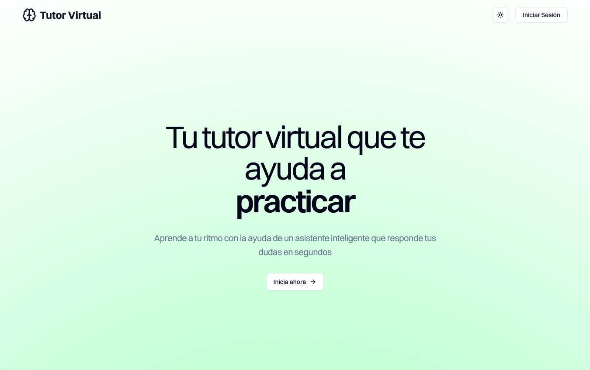
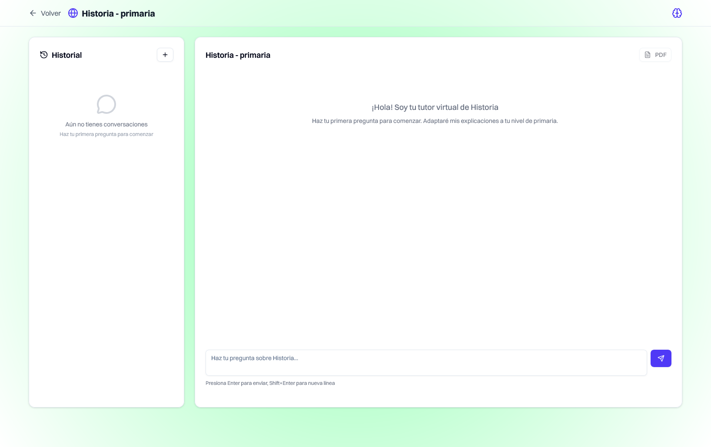

# Tutor Virtual por Materia (MVP)

Una aplicación web donde estudiantes pueden seleccionar una materia, escribir preguntas y recibir respuestas pedagógicas generadas por IA adaptadas al nivel educativo.

## Características

- ✅ Selección de materia y nivel educativo
- ✅ Chat interactivo con IA pedagógica
- ✅ Historial de conversaciones por usuario
- ✅ Exportación a PDF
- ✅ Autenticación con Clerk
- ✅ Base de datos con Neon + Drizzle ORM
- ✅ Soporte para OpenAI y Anthropic

## Stack Tecnológico

- **Framework**: Next.js 15 (App Router) + TypeScript
- **UI**: Tailwind CSS + ShadCN UI
- **Formularios**: react-hook-form + Zod
- **IA**: AI SDK (OpenAI/Anthropic)
- **Base de datos**: Neon PostgreSQL + Drizzle ORM
- **Autenticación**: Clerk
- **Subida de archivos**: UploadThing (opcional)
- **PDF**: pdf-lib

## Instalación

### 1. Clona el repositorio

```bash
git clone <url-del-repo>
cd tutor-virtual-materia
```

### 2. Instala dependencias

```bash
npm install
```

### 3. Configura variables de entorno

Copia `.env.example` a `.env.local`:

```bash
cp .env.example .env.local
```

Configura las siguientes variables:

#### Base de datos (Neon)

1. Crea una cuenta en [Neon](https://neon.tech)
2. Crea una nueva base de datos
3. Copia la URL de conexión a `DATABASE_URL`

#### Autenticación (Clerk)

1. Crea una cuenta en [Clerk](https://clerk.com)
2. Crea una nueva aplicación
3. Copia las claves a `NEXT_PUBLIC_CLERK_PUBLISHABLE_KEY` y `CLERK_SECRET_KEY`

#### IA (Elige uno)

**Para OpenAI:**

```env
OPENAI_API_KEY=sk-...
AI_PROVIDER=openai
```

**Para Anthropic:**

```env
ANTHROPIC_API_KEY=sk-ant-...
AI_PROVIDER=anthropic
```

### 4. Ejecuta migraciones

```bash
npm run migrate
```

### 5. (Opcional) Carga datos de ejemplo

```bash
npm run db:seed
```

### 6. Inicia la aplicación

```bash
npm run dev
```

La aplicación estará disponible en `http://localhost:3000`

## Scripts disponibles

- `npm run dev` - Inicia el servidor de desarrollo
- `npm run build` - Construye la aplicación para producción
- `npm run start` - Inicia el servidor de producción
- `npm run lint` - Ejecuta ESLint
- `npm run lint:fix` - Ejecuta ESLint con corrección automática
- `npm run migrate` - Ejecuta migraciones de base de datos
- `npm run db:studio` - Abre Drizzle Studio (visualizador de BD)
- `npm run db:seed` - Carga datos de ejemplo

## Uso

### 1. Registro/Inicio de sesión

- Visita la aplicación y regístrate o inicia sesión
- Puedes usar el modo de invitado para probar sin autenticación

### 2. Selecciona materia y nivel

- Elige una materia (Matemáticas, Historia, Física, etc.)
- Selecciona tu nivel educativo (Primaria, Secundaria, Universidad)

### 3. Haz preguntas

- Escribe tu pregunta en el chat
- Recibe respuestas pedagógicas adaptadas a tu nivel
- Ve el historial de todas tus conversaciones

### 4. Exporta conversaciones

- Usa el botón de PDF para descargar conversaciones

## Arquitectura

### Frontend

- **App Router de Next.js** para el enrutado
- **ShadCN UI** para componentes de interfaz consistentes
- **Tailwind CSS** para estilado utilitario
- **React Hook Form + Zod** para manejo robusto de formularios

### Backend

- **API Routes de Next.js** para endpoints del servidor
- **AI SDK** como abstracción para múltiples proveedores de IA
- **Drizzle ORM** para consultas type-safe a la base de datos
- **Clerk** para autenticación y gestión de usuarios

### Base de datos

Esquema principal:

- `users` - Información de usuarios (gestionado por Clerk)
- `chats` - Sesiones de chat por materia/nivel
- `messages` - Mensajes individuales (pregunta/respuesta)

## Cambiar proveedor de IA

Para cambiar entre OpenAI y Anthropic, simplemente modifica la variable de entorno:

```env
# Para OpenAI
AI_PROVIDER=openai
OPENAI_API_KEY=sk-...

# Para Anthropic
AI_PROVIDER=anthropic
ANTHROPIC_API_KEY=sk-ant-...
```

El código detecta automáticamente el proveedor y ajusta la configuración.

## Personalización de prompts

Los prompts están en `lib/prompts.ts` y pueden personalizarse por:

- Materia específica
- Nivel educativo
- Tipo de respuesta deseada

## Desarrollo

### Estructura de carpetas

```
├── app/                 # App Router de Next.js
│   ├── (auth)/         # Rutas de autenticación
│   ├── api/            # API Routes
│   ├── subject/        # Páginas de chat por materia
│   └── globals.css     # Estilos globales
├── components/         # Componentes React reutilizables
├── lib/               # Utilidades y configuración
├── migrations/        # Migraciones de base de datos
└── scripts/          # Scripts de desarrollo
```

### Contribución

1. Fork del proyecto
2. Crea una rama feature (`git checkout -b feature/nueva-caracteristica`)
3. Commit cambios (`git commit -am 'Agrega nueva característica'`)
4. Push a la rama (`git push origin feature/nueva-caracteristica`)
5. Crea un Pull Request

## Licencia

MIT
